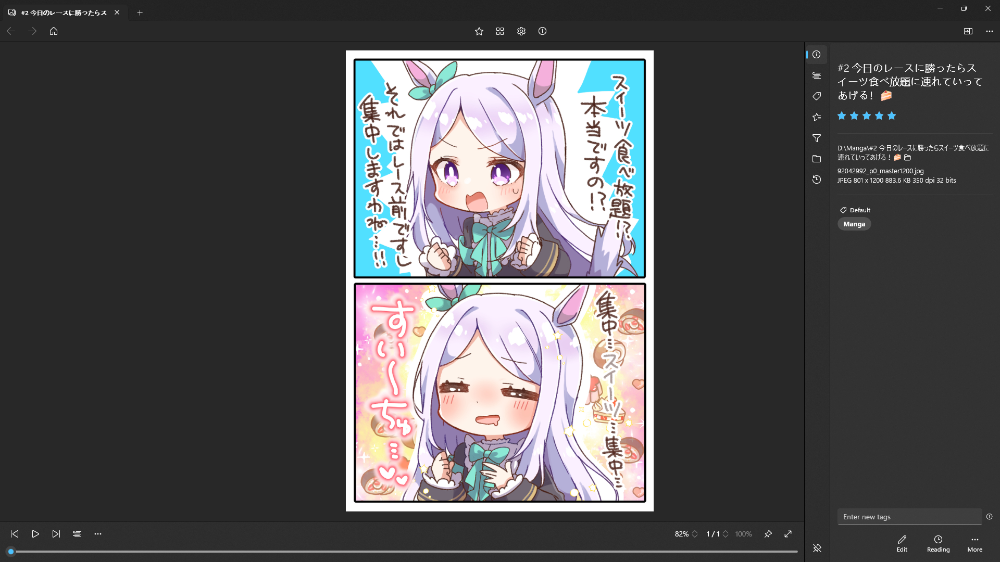

#  Comic Reader UWP
The Comic Reader UWP is a modern Windows app written in C#. The app provided basic functionality for comic reading, along with some common utilities such as file management, searching, tagging, rating, etc.

Comic Reader UWP irregularly ships with new features and bug fixes. You can get the latest version of Comic Reader UWP in the [Microsoft Store](https://www.microsoft.com/store/apps/9NS9FG32DCP5).



## Development
Prerequisites:
- Your computer must be running Windows 10, version 22H2 or newer. Windows 11 is recommended.
- Install the latest version of [Visual Studio](https://visualstudio.microsoft.com/downloads/) (the free community edition is sufficient).
  - Install the ".NET desktop development" and "WinUI application development" workloads.
  - Install the latest Windows 11 SDK.
- Install the [XAML Styler](https://marketplace.visualstudio.com/items?itemName=TeamXavalon.XAMLStyler2022) Visual Studio extension.
- Get the code:
    ```
    git clone git@github.com:aicd0/ComicReaderUWP.git
    ```
- Open [ComicReaderUWP.sln](src/ComicReaderUWP.sln) in Visual Studio to build and run the Comic Reader UWP app.

## Plugins
Comic Reader UWP can be extended with plugins (written in C#). See [Comic Reader UWP Plugins](https://github.com/aicd0/ComicReaderUWPPlugins) for more information.

## Contributing
If Comic Reader UWP is not working properly, you can [submit an issue on GitHub](https://github.com/aicd0/ComicReaderUWP/issues/new/choose). If you know how to fix an issue, it is also encouraged to create a [pull request](https://github.com/aicd0/ComicReaderUWP/pulls) for it.

## License
Licensed under the [MIT License](./LICENSE).
